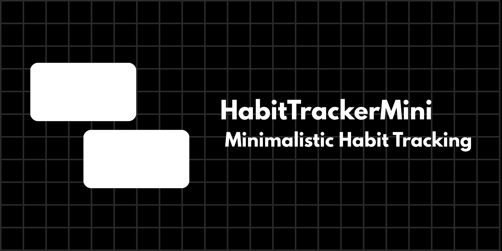

<div align="center">
  

  # HabitTrackerMini

  A minimalist, lightweight habit tracking web application built with **FastAPI** and **Jinja2** templates.
</div>

---

## Features

- **Fast & Lightweight:** Built on top of FastAPI for minimal overhead.
- **Dynamic Views:** Server-rendered HTML powered by Jinja2.
- **Simple Tracking:** Log and keep track of daily habits easily.

---

## Tech Stack

- **Backend:** Python 3.13+, FastAPI
- **ASGI Server:** Uvicorn
- **Templating:** Jinja2
- **Frontend:** HTML, CSS

---

## Getting Started

### Prerequisites
Make sure you have **Python 3.10+** installed on your system.

### Installation

1. **Clone the repository:**
   ```bash
   git clone [https://github.com/krishna12q/HabitTrackerMini.git](https://github.com/krishna12q/HabitTrackerMini.git)
   cd HabitTrackerMini
